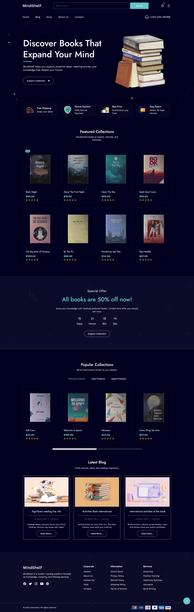

  <h1>GameHub Platform</h1>

  

    <strong>About Project:</strong> 
    A gaming community platform where players create matches, compete online, and connect with gamers worldwide. Built with modular JavaScript components, JSON data structure for easy content management, Tailwind CSS for responsive styling, and smooth scroll interactions. Features live match displays, gaming store, blog section, and sticky navigation all organized with clean separation of concerns for easy updates, and much more.
  

  
 
    <strong>What I learned:</strong>
    Implemented modular ES6 component architecture with separate render functions, used async/await for JSON data fetching, created dynamic content rendering with template literals, and built mobile-first responsive layouts using Tailwind utility classes, and much more.
  

  
 
  <strong>Personal Note:</strong>
  I began my web development journey in 2022, focusing on learning fundamentals before sharing my work on GitHub. Currently I'm building <strong>Full Stack applications</strong> and seeking opportunities as a <strong>Frontend Developer</strong> or <strong>Full Stack Developer</strong>. Thank You!

 
  <strong>Personal Note:</strong>
  I began my web development journey in 2022, focusing on learning fundamentals before sharing my work on GitHub.  
  Currently I'm building <strong>Full Stack applications</strong> and seeking opportunities as a <strong>Frontend Developer</strong> or <strong>Full Stack Developer</strong>. Thank You!

 
  
<h2>Project More Details</h2>

  
 
    
<h4>What's Inside</h4>

    <ul>
      <li><strong>Top Bar</strong> - Promotional banner with countdown days and social media links (desktop only)</li>
      <li><strong>Sticky Header</strong> - Fixed navigation that appears on scroll with logo and menu links</li>
      <li><strong>Mobile Menu</strong> - Slide-down navigation with smooth animation and close button</li>
      <li><strong>Hero Section</strong> - Full-screen background image with title, description, and call-to-action button</li>
      <li><strong>Brand Partners</strong> - Horizontal scrollable partner logos with hover opacity effects</li>
      <li><strong>Latest Matches</strong> - Game cards with category badges, titles, and entry fees in overlay design</li>
      <li><strong>Live Arena</strong> - Video banner with play button, team logos, and match countdown timer</li>
      <li><strong>Featured Games</strong> - Grid layout cards with hover overlay effects showing game titles and platforms</li>
      <li><strong>Gaming Store</strong> - Product cards with images, category badges, prices, and cart buttons</li>
      <li><strong>Blog Section</strong> - News articles with author info, dates, excerpts, and read more links</li>
      <li><strong>Footer</strong> - Brand description, product links, help resources, social icons, and newsletter signup</li>
      <li><strong>Back to Top</strong> - Floating button that appears after scrolling down the page</li>
    </ul>
  

  
 
    
<h4>Technologies Used</h4>

    <ul>
      <li><strong>HTML5</strong> - Semantic structure with root elements for component injection</li>
      <li><strong>Tailwind CSS</strong> - Utility-first styling with responsive breakpoints and custom configuration</li>
      <li><strong>JavaScript (ES6+)</strong> - Modular components with async/await, template literals, and DOM manipulation</li>
      <li><strong>JSON</strong> - Structured data files for all content sections (header, hero, blog, shop, etc.)</li>
      <li><strong>Google Fonts</strong> - Oxanium and Poppins font families for gaming aesthetic</li>
      <li><strong>Ionicons</strong> - Icon library for UI elements and social media</li>
      <li><strong>ES6 Modules</strong> - Import/export syntax for component separation</li>
      <li><strong>Fetch API</strong> - Asynchronous data loading from JSON files</li>
    </ul>
  

  
 
    
<h4>Project Structure</h4>

    <pre>
    game-hub/
    │
    ├── index.html                 # Main HTML with root elements for components
    │
    ├── assets/
    │   ├── data/
    │   │   ├── header.json       # Navigation menu and top bar data
    │   │   ├── hero.json         # Hero section content
    │   │   ├── brand.json        # Partner logos
    │   │   ├── latest.json       # Latest matches data
    │   │   ├── live.json         # Live match information
    │   │   ├── featured.json     # Featured games
    │   │   ├── shop.json         # Store products
    │   │   ├── blog.json         # Blog posts
    │   │   └── footer.json       # Footer content
    │   │
    │   ├── js/
    │   │   ├── app.js            # Main entry point, initializes all components
    │   │   ├── header.js         # Header render with sticky scroll and mobile menu
    │   │   ├── hero.js           # Hero section render
    │   │   ├── brand.js          # Brand partners render
    │   │   ├── latest.js         # Latest matches render
    │   │   ├── live.js           # Live match arena render
    │   │   ├── featured.js       # Featured games render
    │   │   ├── shop.js           # Store section render
    │   │   ├── blog.js           # Blog section render
    │   │   ├── footer.js         # Footer render
    │   │   └── backTop.js        # Back to top button functionality
    │   │
    │   └── images/               # Background images, game covers, blog images, logos
    │
    └── README.md                 # Project documentation
    </pre>
  

  
 
    
<h4>Key Features</h4>

    <ul>
      <li><strong>Modular Architecture</strong> - Separate JavaScript files for each section with clean component structure</li>
      <li><strong>JSON-Driven Content</strong> - All content stored in JSON files for easy updates without touching code</li>
      <li><strong>Fully Responsive</strong> - Mobile-first design with Tailwind breakpoints for all screen sizes</li>
      <li><strong>Sticky Navigation</strong> - Header becomes fixed with shadow after scrolling 120px down</li>
      <li><strong>Mobile Menu Animation</strong> - Smooth slide-down menu with dynamic height calculation and icon toggle</li>
      <li><strong>Horizontal Scrolling</strong> - Touch-friendly card carousels for brands, games, and products</li>
      <li><strong>Hover Effects</strong> - Image zoom, overlay transitions, and color changes on cards and buttons</li>
      <li><strong>Background Overlays</strong> - Semi-transparent black backgrounds on hero and live sections</li>
      <li><strong>Interactive Elements</strong> - Play button on video, cart buttons on products, read more links</li>
      <li><strong>Back to Top Button</strong> - Floating button with smooth scroll appears after 300px scroll</li>
      <li><strong>Newsletter Form</strong> - Email subscription input with submit button in footer</li>
      <li><strong>Social Media Links</strong> - Color-coded social icons with brand colors</li>
      <li><strong>Easy Customization</strong> - Tailwind utilities and JSON structure allow quick styling and content changes</li>
    </ul>
  

  
 
    
<h4>Quick Start</h4>

    <ol>
      <li>
        <strong>Clone the repository:</strong>
        <pre><code>git clone https://github.com/nawazdevx/game-hub.git</code></pre>
      </li>

      <li>
        <strong>Open the project:</strong>
        <ul>
          <li>Open <code>index.html</code> directly in your browser</li>
          <li>Or run a local server:</li>
        </ul>

        <pre><code>python -m http.server 3000</code></pre>
        Then visit <code>http://localhost:3000</code>
      </li>

      <li>
        <strong>Start Customizing:</strong>
        <ul>
          <li>Update content in JSON files inside <code>assets/data/</code> folder</li>
          <li>Modify Tailwind classes in component files inside <code>assets/js/</code></li>
          <li>Replace images in <code>assets/images/</code> folder</li>
          <li>Update meta tags and title in <code>index.html</code></li>
        </ul>
      </li>
    </ol>
  

  
 
    
<h4>Customization</h4>

    <ul>
      <li><strong>Text Content:</strong> Edit JSON files in <code>assets/data/</code> - update game titles, descriptions, prices, blog posts, and footer information</li>
      <li><strong>Colors:</strong> Modify Tailwind classes in component render functions or update the Tailwind config in <code>index.html</code>
        <pre><code>tailwind.config = {
  theme: {
    extend: {
      colors: {
        primary: '#facc15',     // Yellow accent color
        dark: '#171717',        // Dark background
      }
    }
  }
}</code></pre>
      </li>
      <li><strong>Images:</strong> Replace files inside <code>assets/images/</code> with your own gaming photos and keep the same filenames, or update the JSON file paths</li>
      <li><strong>Fonts:</strong> Change Google Fonts link in HTML <code>&lt;head&gt;</code> and update the <code>fontFamily</code> in Tailwind config</li>
      <li><strong>Navigation Menu:</strong> Add or remove menu items by editing <code>header.json</code> menu array</li>
      <li><strong>Games/Products:</strong> Add new items by duplicating objects in respective JSON arrays (latest.json, featured.json, shop.json)</li>
      <li><strong>Blog Posts:</strong> Update <code>blog.json</code> with new articles, images, dates, and excerpts</li>
      <li><strong>Footer Links:</strong> Modify product links, help resources, and social media in <code>footer.json</code></li>
      <li><strong>Components:</strong> Create new sections by adding a new JS file in <code>assets/js/</code>, importing it in <code>app.js</code>, and adding a root element in <code>index.html</code></li>
    </ul>
  

 
  <strong>License:</strong>
  This project is licensed under the <a href="https://choosealicense.com/licenses/mit/">MIT License</a>.

 
  <strong>Contact:</strong> 
  Connect with me on <a href="https://www.linkedin.com/in/nawazdevx">LinkedIn</a> or visit my <a href="https://nawazdevx.vercel.app/">Portfolio</a>.

 
  <strong>Support:</strong> 
  Found this helpful? Give it a ⭐ on GitHub! Thank you.

 

  <h2>Project Preview</h2>

  

    <strong>You can view the live project here ➜</strong>
    <a href="https://nawazdevx.github.io/game-hub/" target="_blank">
      <strong>Live Demo</strong>
    </a>
  

  

